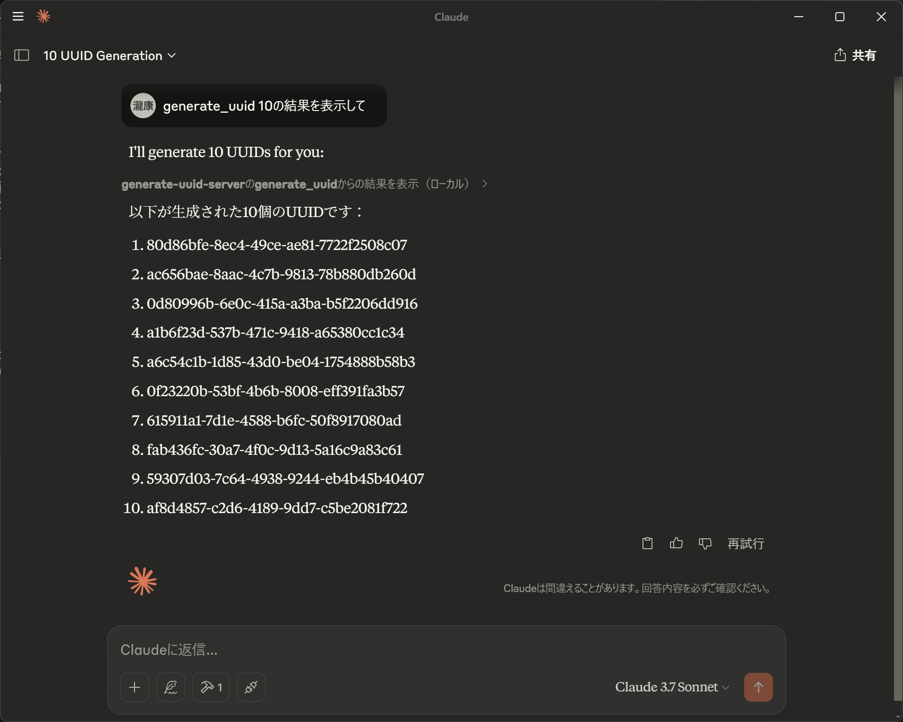

# MCP Generate UUID Server

このプロジェクトは、UUIDを生成するためのMCPサーバー（サンプル実装）です。D言語および `mcp` パッケージライブラリを使用して構築されています。

https://github.com/gtnoble/mcp-d

## 機能

- `generate_uuid` ツールを提供し、指定された数のUUIDを生成します。
- デフォルトでは1つのUUIDを生成しますが、最大100個まで生成可能です。



## ローカル実行手順

1. ローカルパッケージとしてプロジェクトを追加します。
   ```bash
   dub add-local .
   ```

2. サーバーを実行します。
   ```bash
   dub run -q mcp-generate-uuid-server
   ```

## MCPサーバーとしての設定手順

`dub run` コマンドで実行できるように設定します。
`-q` オプションは、`dub run` コマンドの余計な出力を抑えるために使用します。

### Claude Desktopの設定

Claude Desktopを使用している場合、以下のように設定を行います。

```json
{
    "mcpServers": {
        "generate-uuid-server": {
            "command": "dub",
            "args": [
                "run",
                "mcp-generate-uuid-server",
                "-q"
            ]
        }
    }
}
```

### Github Copilotの設定

Github Copilotを使用している場合、以下のように設定を行います。

```json
{
    "mcp": {
        "inputs": [],
        "servers": {
            "generate-uuid-server": {
                "command": "dub",
                "args": [
                    "run",
                    "mcp-generate-uuid-server",
                    "-q"
                ],
                "env": {}
            }
        }
    }
}
```


## MCPプロジェクトの作成手順

このプロジェクトと同様のMCPプロジェクトを作成するには、以下のような手順を行います。

1. DUBを使用して新しいプロジェクトを作成します。
   ```bash
   dub init mcp-generate-uuid-server
   ```

2. 必要な依存関係を追加します。
   `dub.sdl` ファイルに以下の依存関係を追加してください。(`dub add mcp` コマンドを使用しても追加できます。)
   ```sdl
   dependency "mcp" version="~>1.0.0"
   ```

3. プロジェクトのコードを `source/app.d` に記述します。
   - `addTool` メソッドを使用して、UUID生成ツールを追加します。
       - ツール名を指定します
       - ツールの説明を追加します
       - ツール呼び出しのスキーマを定義します
       - ツールの実行ロジックを実装します（`JSONValue` を受け取り、`JSONValue` を返すメソッドです）
